# G002：会員登録画面

## 画面レイアウト

## 項目定義

|  No.  |  項目  |  I/O  |  備考  |
| :---: | --- |:---:| --- |
| 1 | エラーメッセージ | O | ログイン処理にてエラーが発生した場合出力 |
| 2 | 名前 | I |  |
| 3 | メールアドレス | I |  |
| 4 | パスワード | I |  |
| 5 | 郵便番号 | I |  |
| 6 | 住所 | I |  |
| 7 | 電話番号 | I |  |
| 8 | 生年月日 | I | カレンダー入力 |
| 9 | 戻るボタン | - |  |
|  | 確認ボタン | - |  |

## イベント

- 戻るボタン押下
    - 前の画面に戻る

- 確認ボタン押下
    - 会員登録確認画面に遷移する
    - 入力内容にエラーがあった場合はエラーメッセージを表示する
