# M001：共通メニュー

## 画面レイアウト

## 画面項目定義

|  No.  |  項目  |  I/O  |  備考  |
| :---: | --- |:---:| --- |
| 1 | ロゴ画像 | - |  |
| 2 | ログインリンク | - | 未ログイン時表示 |
| 3 | 新規会員登録リンク | - | 未ログイン時表示 |
| 4 | マイページリンク | - | ログイン時表示 |
| 5 | カートボタン | - |  |

## イベント

- ロゴ画像押下
    - 商品一覧画面（トップページ）に遷移する

- ログインリンク押下
    - ログイン画面に遷移する
    
- 新規会員登録リンク押下
    - 新規会員登録画面に遷移する

- マイページリンク押下
    - 会員情報画面に遷移する

- カートボタン押下
    - カート画面に遷移する
